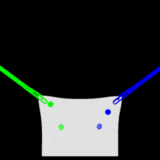

# SOFA_ENV
Gym environments for reinforcement learning based on the [SOFA Simulation Framework](https://www.sofa-framework.org/).
This repository is part of "LapGym - An Open Source Framework for Reinforcement Learning in Robot-Assisted Laparoscopic Surgery".
See [LapGym](https://www.jmlr.org/papers/v24/23-0207.html) for the paper and [lap_gym](https://github.com/ScheiklP/lap_gym) for the top level repository.

## Getting Started
### Getting the right python version
1. Install [pyenv](https://github.com/pyenv/pyenv?tab=readme-ov-file#installation)
2. Make sure you also installed the [build dependencies](https://github.com/pyenv/pyenv?tab=readme-ov-file#install-python-build-dependencies)
3. Install python 3.10 through pyenv
```bash
pyenv install 3.10.15
```
4. Create a virtualenv with python 3.10 for sofa and activate it
```bash
pyenv virtualenv 3.10.15 sofa
pyenv activate sofa
```

### Option A (recommended): Using prebuilt SOFA binaries
1. Clone this repository
```bash
git clone https://github.com/ScheiklP/sofa_env.git 
```

2. Install the repository
```bash
cd sofa_env
pip install -e .
```

3. Test the installation
```bash
python3 sofa_env/scenes/controllable_object_example/controllable_env.py
```

### Option B (for the reckless): Manually setting up SOFA and SofaPython3
If you want to set up SOFA and SofaPython3 manually, you can follow the [instructions](docs/source/setting_up_sofa.rst) to install SOFA and SofaPython3.
And then install the `sofa_env` package with an environment variable to tell the setup script to skip the SOFA installation.
```bash
git clone https://github.com/ScheiklP/sofa_env.git 
cd sofa_env
SKIP_SOFA=1 pip install -e .
python3 sofa_env/scenes/controllable_object_example/controllable_env.py
```

## Environments
This repository currently contains 14 reinforcement learning environments.
- 12 robot-assited laparoscopy environments from [LapGym](https://www.jmlr.org/papers/v24/23-0207.html)
- a reinforcement learning environment around the scene from [A Simulation Framework for Magnetic Continuum Robots](https://github.com/ethz-msrl/mCR_simulator)
- the reinforcement learning environment from [Sim-to-Real Transfer for Visual Reinforcement Learning of Deformable Object Manipulation for Robot-Assisted Surgery](https://ieeexplore.ieee.org/abstract/document/9976185)
- an additional environment for bimanual tissue manipulation from [Movement Primitive Diffusion](https://scheiklp.github.io/movement-primitive-diffusion/).

<table style="width: 100%; border-collapse: collapse; border: 0;">
 </tr>
    <tr>
    <td> Reach </td>
    <td> Deflect Spheres </td>
    <td> Search for Point </td>
  </tr>
  <tr>
    <td>
      
    </td>
    <td>
      
    </td>
    <td>
      
    </td>
  </tr>
  <tr>
    <td> Tissue Manipulation </td>
    <td> Pick and Place </td>
    <td> Grasp Lift and Touch </td>
  </tr>
  <tr>
    <td>
      
    </td>
    <td>
      
    </td>
    <td>
      
    </td>
  </tr>
  <tr>
    <td> Rope Cutting </td>
    <td> Precision Cutting </td>
    <td> Tissue Dissection </td>
  </tr>
  <tr>
    <td>
      
    </td>
    <td>
      
    </td>
    <td>
      
    </td>
  </tr>
  <tr>
    <td> Thread in Hole </td>
    <td> Rope Threading </td>
    <td> Ligating Loop </td>
  </tr>
  <tr>
    <td>
      
    </td>
    <td>
      
    </td>
    <td>
      
    </td>
  </tr>
  <tr>
  </td>
    <td> Tissue Retraction </td>
    <td> Magnetic Continuum Robot </td>
    <td> Bimanual Tissue Manipulation </td>
  </tr>
  <tr>
    <td>
      
    </td>
    <td>
      
    </td>
    <td>
      
    </td>
    </tr>
</table>

## Adding new Environments
A ``SofaEnv`` base class and ``sofa_templates`` are provided to simplify implementing new reinforcement environments.
Please refer to the included documentation for a tutorial on how to build new scenes in SOFA and implement reinforcement environments with ``sofa_env``.
Also visit [sofa_godot](https://github.com/ScheiklP/sofa_godot) for SofaGodot, a [Godot](https://github.com/godotengine/godot) plugin to visually create new SOFA scenes.

## Documentation
You can either access the documentation [here](https://scheiklp.github.io/sofa_env/) or build it locally with

```bash
cd docs
make html
firefox build/html/index.html
```

## Citing
If you use the project in your work, please consider citing it with:
```bibtex
@article{JMLR:v24:23-0207,
  author  = {Paul Maria Scheikl and Balázs Gyenes and Rayan Younis and Christoph Haas and Gerhard Neumann and Martin Wagner and Franziska Mathis-Ullrich},
  title   = {LapGym - An Open Source Framework for Reinforcement Learning in Robot-Assisted Laparoscopic Surgery},
  journal = {Journal of Machine Learning Research},
  year    = {2023},
  volume  = {24},
  number  = {368},
  pages   = {1--42},
  url     = {http://jmlr.org/papers/v24/23-0207.html}
}
```

## Notes
The Freemotion Animation Loop of SOFA solves collisions and other constraints with Lagrange Multipliers.
This method requires the computation of a compliance matrix for each object.
This compliance matrix can be precomputed and is valid as long as the object does not change too much for example through cutting.
Precomputing, handling, and loading the compliance matrix is done by the `PrecomputedConstraintCorrection` object.
If your scene has one or more of them, the object will try to load the matrix from storage, and compute it, when it cannot find the appropriate file.
This can be seen by the terminal output of SOFA when creating the scene.
You may see a `[ERROR]   [FileRepository] File tissue-1479-0.1.comp NOT FOUND in: ...` output which is actually not an error but SOFA telling you it is now generating the precomputed compliance matrix.
This may take up to a few minutes.

## Getting Started with SOFA - Reading List
- To get a general understanding of how SOFA works, read all pages under *Simulation Principles* in the [official documentation](https://www.sofa-framework.org/community/doc/simulation-principles/scene-graph/)
- To get a deeper understanding of the underlying principles, like mappings, read the [SOFA Paper](https://hal.inria.fr/hal-00681539/document).
But be aware, that some terms like *MechanicalState* (now called *MechanicalObject*) in the paper have changed in the actual API.
Use it more as a "how does SOFA work?" not as a "how is SOFA implemented?"
- Look through the [SOFA Tutorials](https://github.com/sofa-framework/sofa/tree/master/examples/Tutorials).
Some of the Tutorials might not work.
That is generally not your fault.
You can run them via the command line. For example

```bash
$FOLDER_TARGET/install/bin/runSofa $FOLDER_SRC/examples/Tutorials/Basic/TutorialBasicCube.scn
```

## Acknowledgements
This work is supported by the Helmholtz Association under the joint research school "HIDSS4Health – Helmholtz Information and Data Science School for Health".
