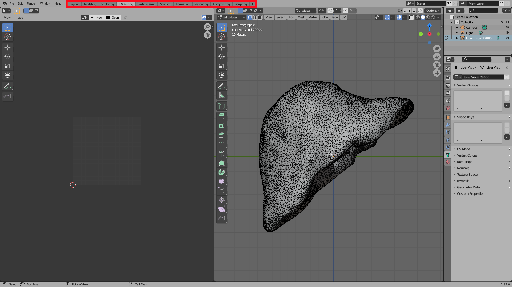
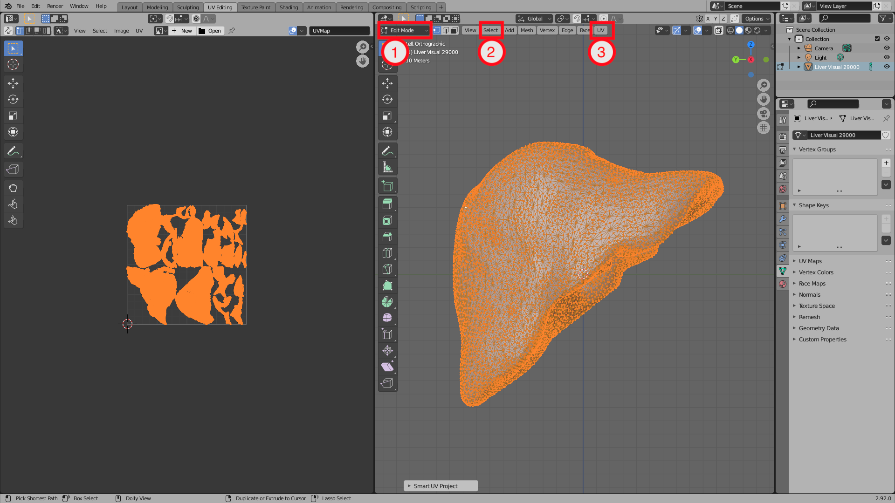
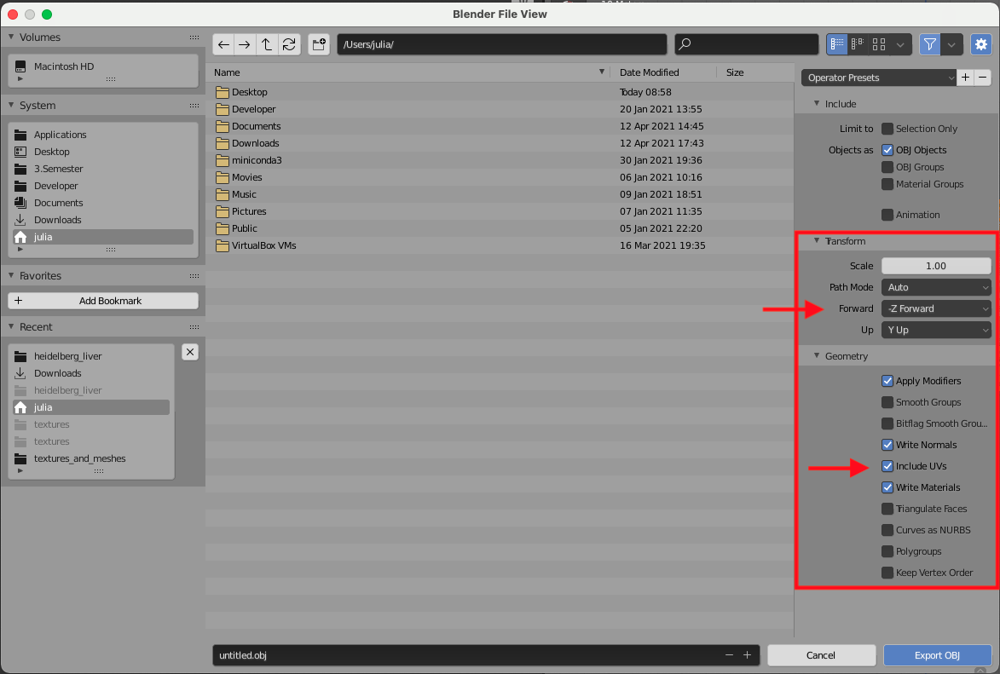
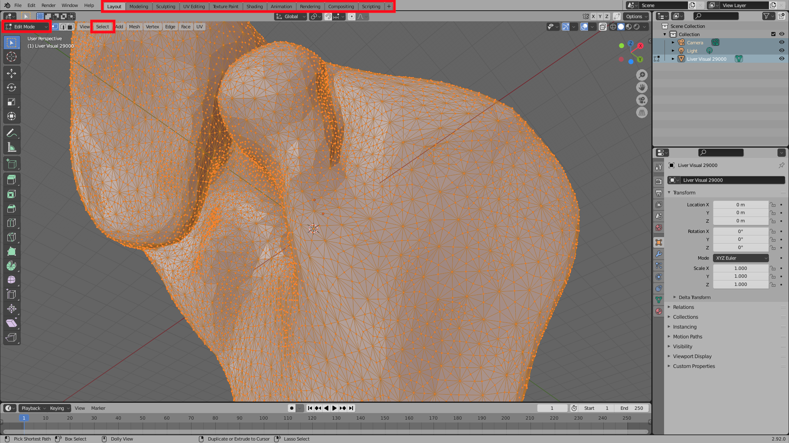
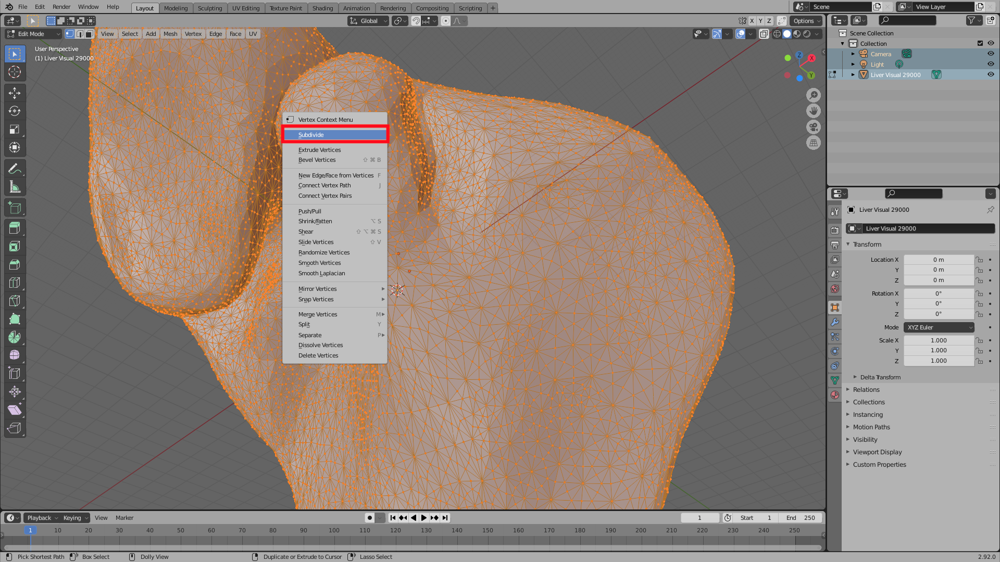
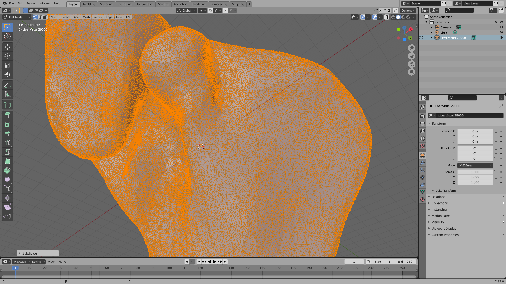

Creating Surface Meshes
=======================

Surface meshes in a ``.stl`` file only contain the vertices and edges of the surface.
If we want to do more sofisticated rendering in SOFA, such as adding texture to an object, we need to use a file format that allows extra information.
For textures, this extra information is UV coordinates that describe the mapping from points on the surface to points in a texture file (e.g. a .png image).

Requirements:

* Blender
* template mesh (for example a ``.stl`` mesh of the desired object)

Creating an .obj file with texture coordinates
##############################################
#. Open Blender
#. Import the template mesh:

    * Click ``File -> Import``
    * Select the correct mesh file type
    * Select your template mesh

#. Switch the active workspace to ``UV Editing`` in the top bar.

#. Change the view mode to Edit Mode (Step 1 in the image below)
#. Click ``Select -> All`` (Step 2 in the image below)
#. Click ``UV -> Smart UV Project`` and leave all settings in the popup as default (Step 3 in the image below)

#. Export the mesh: Click ``File -> Export -> Wavefront (.obj)``
#. In the file menu, on the right:

    * Under ``Geometry`` select ``Include UV's``
    * Under ``Transform`` you might have to change ``Forward`` and ``Up`` in order to get the orginal orientation.

#. Finally press ``Export OBJ``

Creating an .obj file with higher resolution
############################################
This is achieved by subdividing the polygones of the mesh.

#. Open Blender
#. Import the template mesh:

    * Click ``File -> Import``
    * Select the correct mesh file type
    * Select your template mesh

#. In the layout workspace swith to Edit Mode and click ``Select -> All``

#. Right-click the liver
#. Press ``Subdivide``

#. You should be able to see the changes (more vertices)

#. Repeat the process until you are happy with the number of vertices.
#. Export the mesh as ``.obj`` file following the steps above.

