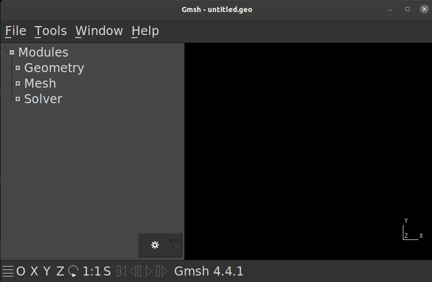

Meshing a Surface Model
========================

To simulate the behavior of a soft body (for example with FEM), we need to create a volumetric representation of the object.
In most cases this will be a tetrahedral mesh (3D version of triangles).
The author of this tutorial used gmsh to create a volume mesh from an .stl file.
We will only be showing how to do this using the GUI.
We would gladly see a good way to do this via the terminal using a command.
The following will be a textual and a visual description of the process.

Text Description
################
.. warning::
  There are compatibility issues between the open source Nvidia Nouveau driver and gmsh. Please make sure you are using the official and proprietary Nvidia driver. If you are using Nouveau you will see segfaults when trying to add a volume to a mesh. We suggest you switch the driver using the "Additional Drivers" tool in Ubuntu. If you just installed Ubuntu and are using an Nvidia GPU, you will most likely be using Nouveau, so please switch.

#. Read warning above if you are using an Nvidia GPU
#. Install gmsh (Ubuntu) ``sudo apt install gmsh``
#. Start gmesh with correct file ``gmsh FILE_YOU_WANT_TO_OPEN.stl``
   or open gmsh and use File->Open...
#. On the left, find activate the tool ``Volume`` under ``Modules->Geometry->Elementary entities->Add->Volume`` and left-click on it. You should see the text *"Select volume boundary"* at the top of the 3D view now.
#. Now select your geometry in the 3D view on the right. The wireframe should now turn red, and a window will pop up. Select the option ``Create new '.geo' file``. If you select the other option, your .stl file will be overwritten.
#. Now the text at the top of the 3D view should say *"Select hole boundaries (if none, press 'e')"*. Press ``e``.
#. On the left, find the option ``3D`` under ``Modules->Mesh->3D`` and left-click it.
#. You should now be able to see that the volume model has been created. Next we want to export this.
#. Select ``File->Export...`` and name your file suitably. For example: ``my_file.msh``. You can also select the output file format manually, choose .msh if you do.
#. An options window should now open, select the option ``Version 2 ASCII`` from the drop-down menu. This version is supported by SOFAs GMsh loader. Then press ``OK``
#. Done, your .msh file has been written to the location you selected previously.

Video Description
#################

*Note, after selecting the model in the 3D view,* ``e`` *was pressed.*

