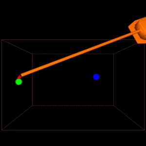
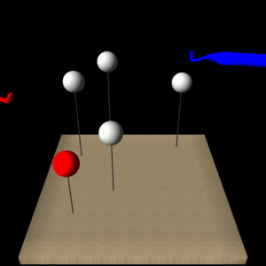
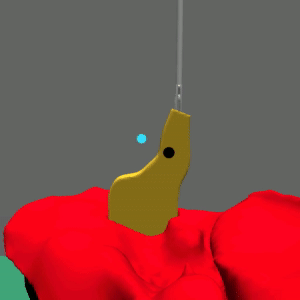
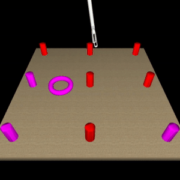
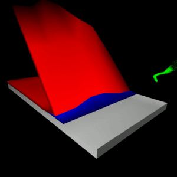
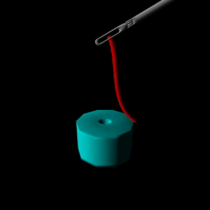
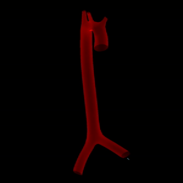

.. _scenes:

Scenes
======

Reach
-----

Reward Features
^^^^^^^^^^^^^^^
- distance_to_target: Distance between end effector and target in meters.
- delta_distance_to_target: Change in distance between end effector and target in meters since the last step.
- time_step_cost: 1.0 for every step.
- workspace_violation: 1.0 if the action would have violated the workspace.
- successful_task: 1.0 if the distance between the end effector and the target is below the threshold ``distance_to_target_threshold``.

Environment
^^^^^^^^^^^
.. autoclass:: sofa_env.scenes.reach.reach_env.ReachEnv
    :members:
    :undoc-members:
    :show-inheritance:

Scene Description
^^^^^^^^^^^^^^^^^
.. automodule:: sofa_env.scenes.reach.scene_description
    :members:
    :undoc-members:
    :show-inheritance:

DeflectSpheres
--------------

Reward Features
^^^^^^^^^^^^^^^
- action_violated_cartesian_workspace: Number of tools that violate their Cartesian workspace.
- action_violated_state_limits: Number of tools that violate their state limits.
- tool_collision: Whether the tools collide.
- distance_to_active_sphere: Distance from the cauter tip to the active sphere.
- delta_distance_to_active_sphere: Change in distance from the cauter tip to the active sphere.
- deflection_of_inactive_spheres: Sum of the deflections of the inactive spheres.
- deflection_of_active_sphere: Deflection of the active sphere.
- delta_deflection_of_active_sphere: Change in deflection of the active sphere.
- done_with_active_sphere: Whether the active sphere is deflected enough to be considered done.

Environment
^^^^^^^^^^^
.. autoclass:: sofa_env.scenes.deflect_spheres.deflect_spheres_env.DeflectSpheresEnv
    :members:
    :undoc-members:
    :show-inheritance:

Scene Description
^^^^^^^^^^^^^^^^^
.. automodule:: sofa_env.scenes.deflect_spheres.scene_description
    :members:
    :undoc-members:
    :show-inheritance:

SearchForPoint
--------------
.. image:: images/environments/search_for_point.gif
  :width: 250
  :align: center

Reward Features
^^^^^^^^^^^^^^^
**Active Vision:**

- collision_cauter: Cauter has a collision.
- relative_distance_cauter_target: Relative distance between the cauter and the point of interest.
- delta_distance_cauter_target: Difference between the current the the previous relative distance between the cauter and the point of interest.
- cauter_touches_target: ``True`` if the distance between the tip position of the cauter and the poi is smaller than ``instrument_touch_tolerance``.
- successful_task: ``True`` if the cauter touches the target and is activated.
- cauter_action_violated_state_limits: Cauter violated the state limits.

**No Cauter:**

- poi_is_in_frame: Point of interest is in the camera frame.
- relative_camera_distance_error_to_poi: Distance between the desired and actual camera to point of interest distance normalized by the desired distance (``abs(distance)/target_distance``).
- delta_relative_camera_distance_error_to_poi: Change in distance between the desired and actual camera to poi distance.
- relative_pixel_distance_poi_to_image_center: Distance between the image center and the poi in pixels normalized by the maximum pixel distance in frame.
- delta_relative_pixel_distance_poi_to_image_center: Change in distance between the center and the poi in the image.
- sucessful_task: Task is successful if the poi is in the camera frame, the camera is close enough to the poi and the poi is centered in the image.

Environment
^^^^^^^^^^^
.. autoclass:: sofa_env.scenes.search_for_point.search_for_point_env.SearchForPointEnv
    :members:
    :undoc-members:
    :show-inheritance:

Scene Description
^^^^^^^^^^^^^^^^^
.. automodule:: sofa_env.scenes.search_for_point.scene_description
    :members:
    :undoc-members:
    :show-inheritance:

TissueManipulation
------------------

Reward Features
^^^^^^^^^^^^^^^
- distance_to_target: Distance between TTP and IDP.
- one_time_reward_goal: TTP reached IDP.
- one_time_penalty_is_stuck: Policy is stuck (does not move).
- one_time_penalty_invalid_action: Action would have violated the workspace constraints.
- one_time_penalty_unstable_simulation: Simulation is unstable.

Environment
^^^^^^^^^^^
.. autoclass:: sofa_env.scenes.tissue_manipulation.tissue_manipulation_env.TissueManipulationEnv
    :members:
    :undoc-members:
    :show-inheritance:

Scene Description
^^^^^^^^^^^^^^^^^
.. automodule:: sofa_env.scenes.tissue_manipulation.scene_description
    :members:
    :undoc-members:
    :show-inheritance:

PickAndPlace
------------

Reward Features
^^^^^^^^^^^^^^^
- grasped_torus: Whether the gripper is grasping the torus.
- established_grasp: Whether the gripper has established a new grasp on the torus in this step.
- lost_grasp: Whether the gripper has lost its grasp on the torus in this step.
- torus_distance_to_active_pegs.
- delta_torus_distance_to_active_pegs.
- gripper_distance_to_torus_center: The distance between the middle of the gripper jaw and the torus' center of mass.
- delta_gripper_distance_to_torus_center.
- gripper_distance_to_torus_tracking_points.
- delta_gripper_distance_to_torus_tracking_points.
- gripper_jaw_peg_collisions: Number of collisions between the gripper jaw collision models and the pegs.
- gripper_jaw_floor_collisions.
- unstable_deformation: An approximation of whether the torus deformation might be unstable. Checked by looking at the velocities of the torus.
- torus_velocity: The mean Cartesian velocity of all points of the torus.
- gripper_velocity: The Cartesian velocity of the gripper's jaw joint.
- torus_dropped_off_board: Whether the torus is not on the board any more.
- action_violated_state_limits: Whether the last action would have violated the state limits of the gripper.
- action_violated_cartesian_workspace: Whether the last action would have violated the Cartesian workspace limits of the gripper.
- successful_task: Whether the torus was placed on one of the active pegs.
- distance_to_minimum_pick_height: The distance in height between the torus' center of mass and the ``minimum_lift_height``.
- delta_distance_to_minimum_pick_height: The change in distance in height between the torus' center of mass and the ``minimum_lift_height``.

Environment
^^^^^^^^^^^
.. autoclass:: sofa_env.scenes.pick_and_place.pick_and_place_env.PickAndPlaceEnv
    :members:
    :undoc-members:
    :show-inheritance:

Scene Description
^^^^^^^^^^^^^^^^^
.. automodule:: sofa_env.scenes.pick_and_place.scene_description
    :members:
    :undoc-members:
    :show-inheritance:

GraspLiftTouch
--------------
.. image:: images/environments/grasp_lift_touch.gif
  :width: 250
  :align: center

Reward Features
^^^^^^^^^^^^^^^
- collision_cauter_gripper: Whether the cauter collides with the gripper.
- collision_cauter_gallbladder: Whether the cauter collides with the gallbladder.
- collision_cauter_liver: Whether the cauter collides with the liver.
- collision_gripper_liver: Whether the gripper collides with the liver.
- distance_cauter_target: Distance between cauter and target.
- delta_distance_cauter_target: Change in distance between cauter and target.
- target_visible: Whether the target is visible to the camera.
- gallbladder_is_grasped: Whether the gallbladder is grasped by the gripper.
- new_grasp_on_gallbladder: Whether a new grasp has been established on the gallbladder in this step.
- lost_grasp_on_gallbladder: Whether a grasp has been lost in this step.
- active_grasping_springs: Number of springs between gripper and gallbladder (indicates grasp strength).
- delta_active_grasping_springs: Change in number of springs between gripper and gallbladder.
- gripper_pulls_gallbladder_out: Change in distance between gripper and trocar during grasp.
- overlap_gallbladder_liver: Overlap between FEM model of liver and gallbladder.
- delta_overlap_gallbladder_liver: Change in overlap between FEM model of liver and gallbladder.
- dynamic_force_on_gallbladder: How much force acts on the gallbladder.
- successful_task: Task is done.
- failed_task: Task failed.
- cauter_action_violated_state_limits: Cauter action would have violated the PTSD state limits.
- cauter_action_violated_cartesian_workspace: Cauter action would have violated the Cartesian workspace.
- gripper_action_violated_state_limits: Gripper action would have violated the PTSD state limits.
- gripper_action_violated_cartesian_workspace: Gripper action would have violated the Cartesian workspace.
- phase_change: Change in phase for this step. >0 for advanced phase and <0 for decreased phase.
- distance_gripper_graspable_region: Distance between gripper and gallbladder infundibulum.
- delta_distance_gripper_graspable_region: Change in distance between gripper and gallbladder infundibulum.
- cauter_activation_in_target: Magnitude of cauter activation in the target.
- cauter_delta_activation_in_target: Change in magnitude of cauter activation in the target.
- cauter_touches_target: Whether the cauter touches the target.

Environment
^^^^^^^^^^^
.. autoclass:: sofa_env.scenes.grasp_lift_touch.grasp_lift_touch_env.GraspLiftTouchEnv
    :members:
    :undoc-members:
    :show-inheritance:

Scene Description
^^^^^^^^^^^^^^^^^
.. automodule:: sofa_env.scenes.grasp_lift_touch.scene_description
    :members:
    :undoc-members:
    :show-inheritance:

RopeCutting
-----------
.. image:: images/environments/rope_cutting.gif
  :width: 250
  :align: center

Reward Features
^^^^^^^^^^^^^^^
- distance_cauter_active_rope: Minimal distance between the cauter and the active rope.
- delta_distance_cauter_active_rope: Change in distance between the cauter and the active rope.
- cut_active_rope: Sum of topological changes of the active rope.
- cut_inactive_rope: Sum of topological changes of the inactive ropes.
- workspace_violation: 1.0 if the cauter action would have violated the workspace, 0.0 otherwise.
- state_limits_violation: 1.0 if the cauter action would have violated the state limits, 0.0 otherwise.

Environment
^^^^^^^^^^^
.. autoclass:: sofa_env.scenes.rope_cutting.rope_cutting_env.RopeCuttingEnv
    :members:
    :undoc-members:
    :show-inheritance:

Scene Description
^^^^^^^^^^^^^^^^^
.. automodule:: sofa_env.scenes.rope_cutting.scene_description
    :members:
    :undoc-members:
    :show-inheritance:

PrecisionCutting
----------------
.. image:: images/environments/precision_cutting.gif
  :width: 250
  :align: center

Reward Features
^^^^^^^^^^^^^^^

Environment
^^^^^^^^^^^
.. autoclass:: sofa_env.scenes.precision_cutting.precision_cutting_env.PrecisionCuttingEnv
    :members:
    :undoc-members:
    :show-inheritance:

Scene Description
^^^^^^^^^^^^^^^^^
.. automodule:: sofa_env.scenes.precision_cutting.scene_description
    :members:
    :undoc-members:
    :show-inheritance:

TissueDissection
----------------

Reward Features
^^^^^^^^^^^^^^^

Environment
^^^^^^^^^^^
.. autoclass:: sofa_env.scenes.tissue_dissection.tissue_dissection_env.TissueDissectionEnv
    :members:
    :undoc-members:
    :show-inheritance:

Scene Description
^^^^^^^^^^^^^^^^^
.. automodule:: sofa_env.scenes.tissue_dissection.scene_description
    :members:
    :undoc-members:
    :show-inheritance:

ThreadInHole
------------

Reward Features
^^^^^^^^^^^^^^^

Environment
^^^^^^^^^^^
.. autoclass:: sofa_env.scenes.thread_in_hole.thread_in_hole_env.ThreadInHoleEnv
    :members:
    :undoc-members:
    :show-inheritance:

Scene Description
^^^^^^^^^^^^^^^^^
.. automodule:: sofa_env.scenes.thread_in_hole.scene_description
    :members:
    :undoc-members:
    :show-inheritance:

RopeThreading
-------------
.. image:: images/environments/rope_threading.gif
  :width: 250
  :align: center

Reward Features
^^^^^^^^^^^^^^^

Environment
^^^^^^^^^^^
.. autoclass:: sofa_env.scenes.rope_threading.rope_threading_env.RopeThreadingEnv
    :members:
    :undoc-members:
    :show-inheritance:

Scene Description
^^^^^^^^^^^^^^^^^
.. automodule:: sofa_env.scenes.rope_threading.scene_description
    :members:
    :undoc-members:
    :show-inheritance:

LigatingLoop
-------------
.. image:: images/environments/ligating_loop.gif
  :width: 250
  :align: center

Reward Features
^^^^^^^^^^^^^^^

Environment
^^^^^^^^^^^
.. autoclass:: sofa_env.scenes.ligating_loop.ligating_loop_env.LigatingLoopEnv
    :members:
    :undoc-members:
    :show-inheritance:

Scene Description
^^^^^^^^^^^^^^^^^
.. automodule:: sofa_env.scenes.ligating_loop.scene_description
    :members:
    :undoc-members:
    :show-inheritance:

TissueRetraction
----------------
.. image:: images/environments/tissue_retraction.gif
  :width: 250
  :align: center

Reward Features
^^^^^^^^^^^^^^^

Environment
^^^^^^^^^^^
.. autoclass:: sofa_env.scenes.tissue_retraction.tissue_retraction_env.TissueRetractionEnv
    :members:
    :undoc-members:
    :show-inheritance:

Scene Description
^^^^^^^^^^^^^^^^^
.. automodule:: sofa_env.scenes.tissue_retraction.scene_description
    :members:
    :undoc-members:
    :show-inheritance:

TissueRetraction
----------------
.. image:: images/environments/tissue_retraction.gif
  :width: 250
  :align: center

Reward Features
^^^^^^^^^^^^^^^

Environment
^^^^^^^^^^^
.. autoclass:: sofa_env.scenes.tissue_retraction.tissue_retraction_env.TissueRetractionEnv
    :members:
    :undoc-members:
    :show-inheritance:

Scene Description
^^^^^^^^^^^^^^^^^
.. automodule:: sofa_env.scenes.tissue_retraction.scene_description
    :members:
    :undoc-members:
    :show-inheritance:

Magnetic Continuum Robot
------------------------

This environment is built around the scene from https://github.com/ethz-msrl/mCR_simulator.

Reward Features
^^^^^^^^^^^^^^^
- tip_pos_distance_to_dest_pos: Distance between conituum robot tip and target position.
- delta_tip_pos_distance_to_dest_pos: Change in distance between conituum robot tip and target position.
- workspace_constraint_violation: Whether the action would have violated the workspace.
- successful_task: Whether the task is completed.

Environment
^^^^^^^^^^^
.. autoclass:: sofa_env.scenes.magnetic_continuum_robot.mcr_env.MCREnv
    :members:
    :undoc-members:
    :show-inheritance:
